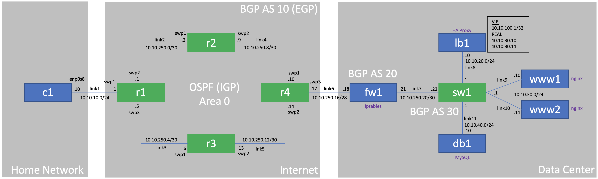

# Sandbox Environment

### Install the following to the local host (windows):

| Name          | Requirements     | Link  |
| ------------- |:----------------:|:-----:|
| Vagrant       | version 2.2.6    | [link](https://releases.hashicorp.com/vagrant/2.2.6/vagrant_2.2.6_x86_64.msi) |
| VirtualBox    | version 6.0.14   | [link](https://download.virtualbox.org/virtualbox/6.0.14/VirtualBox-6.0.14-133895-Win.exe) |
| Wireshark     | version 3.2.0    | [link](https://1.na.dl.wireshark.org/win64/Wireshark-win64-3.2.0.exe) |
| Atom          | version 1.42.0   | [link](https://github.com/atom/atom/releases/download/v1.42.0/AtomSetup-x64.exe) |
| Git           | version 2.24.1.2 | [link](https://github.com/git-for-windows/git/releases/download/v2.24.1.windows.2/Git-2.24.1.2-64-bit.exe) |
| Putty         | version 0.72     | [link](https://the.earth.li/~sgtatham/putty/latest/w64/putty-64bit-0.73-installer.msi) |

### Basic Setup Requirements:

1. Git setup (Clone, Configuration & SSH Keys)
** Open "Git Bash"
2. Disable Hyper-V (VirtualBox conflict resolution)

### Vagrant box image used for setup:

| Name              | Type                     |  Vagrant Box                 |
| ----------------- |:------------------------:| :---------------------------:|
| Cumulus Linux     | Network Operating System | [CumulusCommunity/cumulus-vx](https://app.vagrantup.com/CumulusCommunity/boxes/cumulus-vx)|
| Ubuntu 18.04 LTS  | Operating System         | [ubuntu/bionic64](https://app.vagrantup.com/ubuntu/boxes/bionic64)|

### Software Elements

| Name              | Type                     | Information Link                |
| ----------------- |:------------------------:|:---------------------------:|
| vault             | Secure Key Management    |                             |
| ansible           | Configuration Management |                             |
| GitHub Actions    | CI, Pipeline Management  |                             |
| docker            | Container Engine         |                             |
| nginx             | Web Server               |                             |
| mysql             | Database                 |                             |
| HA Proxy          | Load Balancer            |                             |
| iptables          | Firewall                 |                             |

### Configuration Manual

1. [wiki](https://github.com/sconte934/sandbox01/wiki)

### Topology

